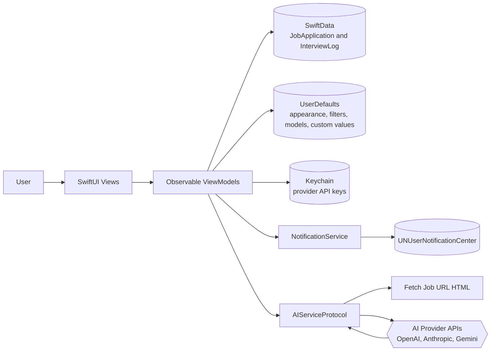
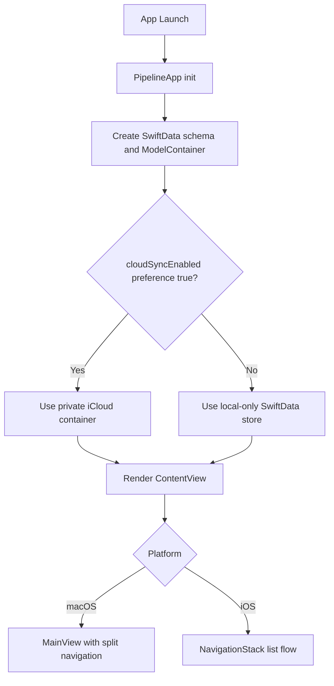
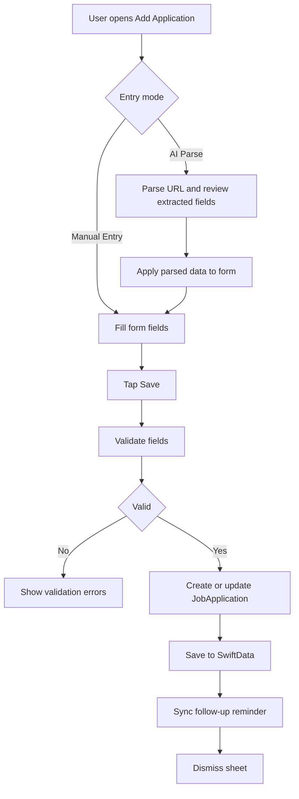
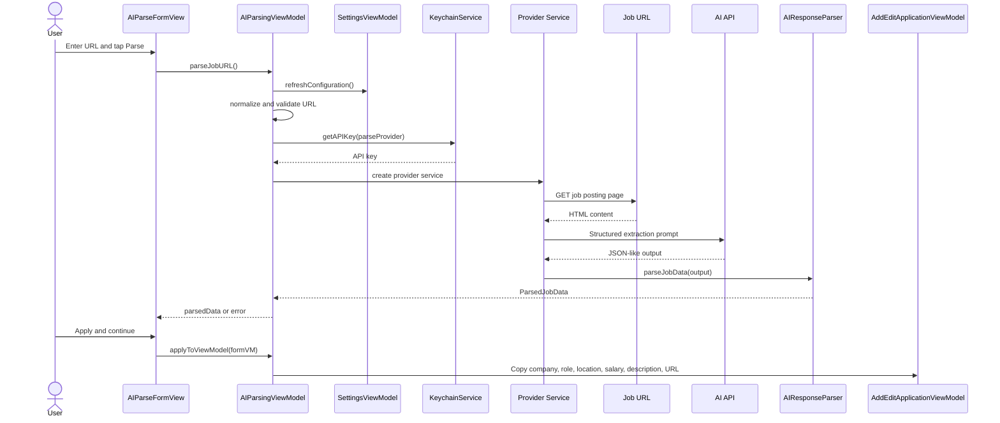
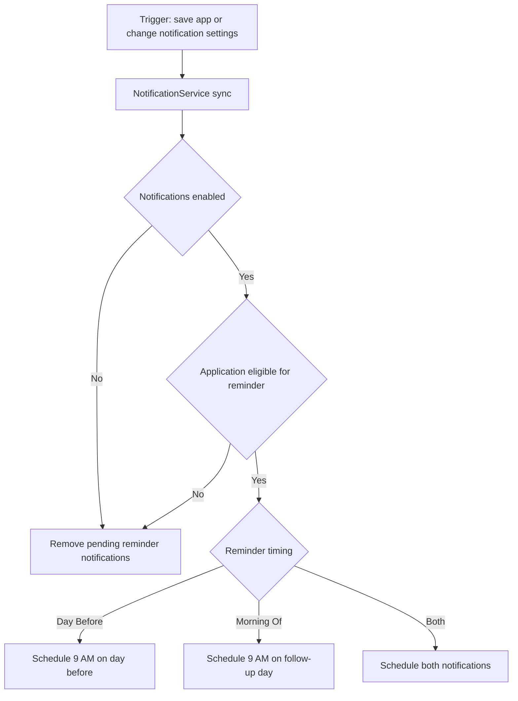
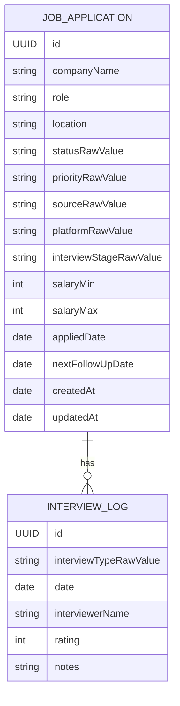

# Pipeline Workflow

## What the app does

Pipeline is a SwiftUI app for tracking job applications from first save to final outcome. It lets you:

- add applications manually or by AI parsing from a job URL
- track status, priority, source, platform, compensation, and interview stage
- log interview history and notes per application
- schedule local follow-up reminders
- configure AI providers and models for parsing

The app is local-first. Core data is stored with SwiftData, API keys are stored in Keychain, and preferences/custom lists are stored in UserDefaults.

## Architecture at a glance

## Startup and shell workflow

### Lifecycle summary

1. `PipelineApp` creates a `ModelContainer` with schema:
   - `JobApplication`
   - `InterviewLog`
2. Cloud sync mode is read from the saved `cloudSyncEnabled` preference:
   - `true`: private CloudKit database with `iCloud.com.pipeline.app`
   - `false`: local-only store
   - changes are applied on next launch
3. `ContentView` loads applications via `@Query` sorted by `updatedAt` descending.
4. Platform-specific shell renders:
   - macOS: split-view app shell (`Sidebar` -> list content -> detail)
   - iOS: `NavigationStack` list + add sheet flow

## Core user workflow

### Browse, filter, and inspect

- `ApplicationListViewModel` applies:
  - sidebar status filter
  - text search on company/role/location
  - sort order (updated, created, company, applied date, priority)
- Stats are derived on the fly from current in-memory query results.
- Selecting a card opens `JobDetailView` for status/priority edits, interview history, and destructive actions.

### Add or edit application

`AddEditApplicationViewModel` owns form state and validation. On save it:

1. validates required fields and URL/salary rules
2. normalizes URL and auto-detects platform when possible
3. inserts or updates `JobApplication` in SwiftData
4. syncs reminder state via `NotificationService`

## AI parsing workflow

The parsing path is provider-aware and resilient to inconsistent model output.

1. `AIParsingViewModel` refreshes configured providers based on saved API keys.
2. URL is normalized and validated (`http/https` only).
3. API key is loaded from Keychain for the selected provider.
4. Provider service fetches HTML from the job URL, strips markup, truncates content, and sends a strict JSON extraction prompt.
5. `AIResponseParser` repairs/normalizes model output and maps aliases into `ParsedJobData`.
6. User applies parsed data back into the manual form view model.

## Reminder synchronization workflow

Reminders are local notifications keyed by `followup-<application-id>-...`.

- When application data changes, reminder sync runs for that application.
- When notification settings change, reminder sync runs for all applications.
- Archived items, missing follow-up dates, and past dates clear pending reminders.

## Data model relationship

## Settings and persistence behavior

- `SettingsViewModel` persists:
  - appearance mode
  - selected AI provider/model
  - fetched model catalogs per provider (with refresh timestamps)
  - notification switches and reminder timing
- `CustomValuesStore` persists custom statuses, sources, and interview stages.
- Model catalogs are refreshed from provider APIs when needed or on manual refresh.
- API keys are never stored in UserDefaults; only in Keychain.

## Platform UX differences

- **macOS**
  - split-view layout with sidebar filters, card grid, and optional detail column
  - add/edit/settings are presented as sheets with custom desktop styling
- **iOS**
  - list-first `NavigationStack` flow
  - add/edit/settings use native mobile form/navigation patterns
